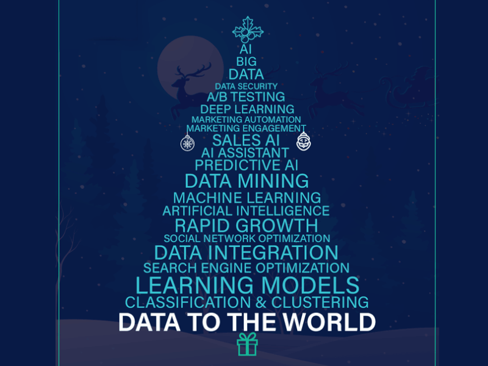

<!--Banner-->

<!--Night Owl image-->

  

<!--Header Name-->
#  ɪ'ᴍ Sᴀʀᴏᴡᴀʀ!
*Data Scientist | Software Developer | MLOps Specialist*

<!--Start Intro-->               

I’m a results-driven professional with 3+ years of experience blending data science, software development, and cutting-edge tech to deliver impactful solutions. My expertise spans machine learning, MLOps, full-stack development, blockchain, and big data, enabling me to optimize processes, uncover actionable insights, and drive strategic decisions.

- ✨ Always learning and experimenting with new technologies
- 🌱 Currently expanding my knowledge in advanced MLOps, big data architectures, and cloud computing
- 💼 Working as a Data Analyst – IDT at BAT Bangladesh
- 💻 Check out my personal site at [sarowar.site](https://sarowar.site)
- ⚡ Fun fact: I’m an avid hackathon competitor and have secured multiple national and international awards

<!--Profile Count Badge-->

  

---

<!--Languages and Tools Section-->       
<h2 align="center">Tᴇᴄʜ sᴛᴀᴄᴋ & Lᴀᴛᴇsᴛ ʙʟᴏɢs</h2> 
<picture>
  <source media="(prefers-color-scheme: dark)" srcset="./animated.gif">
  <source media="(prefers-color-scheme: light)" srcset="./animated.gif">
  
</picture>

 

<h3 align="left">Current Learning</h3>
<ul align="left">
  <li>Refining my advanced ML and deep learning skills.</li>
  <li>Building expertise in big data tools (Spark, Hadoop, ELK Stack, Snowflake).</li>
  <li>Exploring cloud computing with Azure and AWS for scalable MLOps pipelines.</li>
</ul>
  
<h3 align="left">Latest Blog Posts</h3>
<!-- Replace these with your own blog links or remove this section if you do not maintain a blog -->
<ul align="left">
  <li><a href="https://sarowar.site/blog1">Exploring Transformer Architectures in NLP</a></li>
  <li><a href="https://sarowar.site/blog2">Optimizing ETL Pipelines with Apache Airflow</a></li>
  <li><a href="https://sarowar.site/blog3">A Dive into MLOps Best Practices</a></li>
</ul>

 
 
 
 

<!--Trophies Section-->   
<h2 align="center">🏆 Gɪᴛʜᴜʙ Tʀᴏᴘʜɪᴇs 🏆</h2>

  <a href="https://github.com/SarowarSaurav">
    <picture>
      <source media="(prefers-color-scheme: dark)" srcset="https://github-profile-trophy.vercel.app/?username=SarowarSaurav&no-bg=true&row=2&column=6&margin-w=20&margin-h=20&theme=monokai">
      <source media="(prefers-color-scheme: light)" srcset="https://github-profile-trophy.vercel.app/?username=SarowarSaurav&no-bg=true&row=2&column=6&margin-w=20&margin-h=20">
      
    </picture>
  </a>

  

 

<!--Github stats Table--> 
<h2 align="center">📊 Gɪᴛʜᴜʙ Sᴛᴀᴛs 📊</h2>

<table width="100%">
  <tr>
    <td width="50%">
      <h3 align="center"><strong>Gɪᴛʜᴜʙ Sᴛᴀᴛs</strong></h3>
      

        
      

    </td>
    <td width="50%">
      <h3 align="center"><strong>Sᴛʀᴇᴀᴋ Sᴛᴀᴛs</strong></h3>
      

        
      

    </td>
  </tr>
  <tr>
    <td width="50%">
      <h3 align="center"><strong>Lᴀᴛᴇsᴛ Pʀᴏᴊᴇᴄᴛ</strong></h3>
      

        <a href="https://github.com/SarowarSaurav/metdrive">
          <!-- Replace `Some-Project` with one of your actual repos -->
          
        </a>
      

    </td>
    <td width="50%">
      <h3 align="center"><strong>Tᴏᴘ Cᴏɴᴛʀɪʙᴜᴛɪᴏɴs</strong></h3>
      

        
      

    </td>
  </tr>
</table>

 

---

<!--Dynamic Quote card updates everyday at 12 PM--> 
<h2 align="center">🌟 Tʜᴏᴜɢʜᴛ ᴏғ ᴛʜᴇ Dᴀʏ 🌟</h2>

<!--STARTS_HERE_QUOTE_CARD-->

    

<!--ENDS_HERE_QUOTE_CARD-->

---

<!--Contact Section--> 
<!--Contact Section--> 
<h2 align="center">🤝 Cᴏɴɴᴇᴄᴛ Wɪᴛʜ Mᴇ 🤝</h2>

  <!-- Email -->
  

  <!-- Twitter -->
  

  <!-- GitHub -->
  

  <!-- LinkedIn -->
  

 

<!--Footer--> 

  

